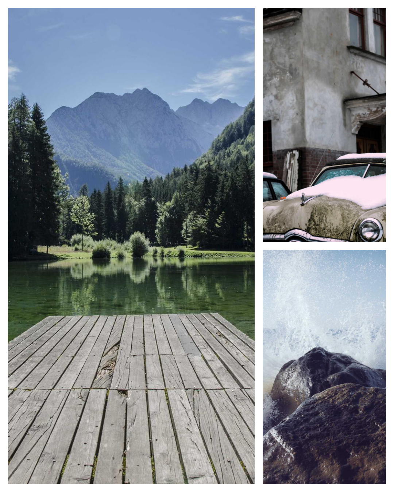
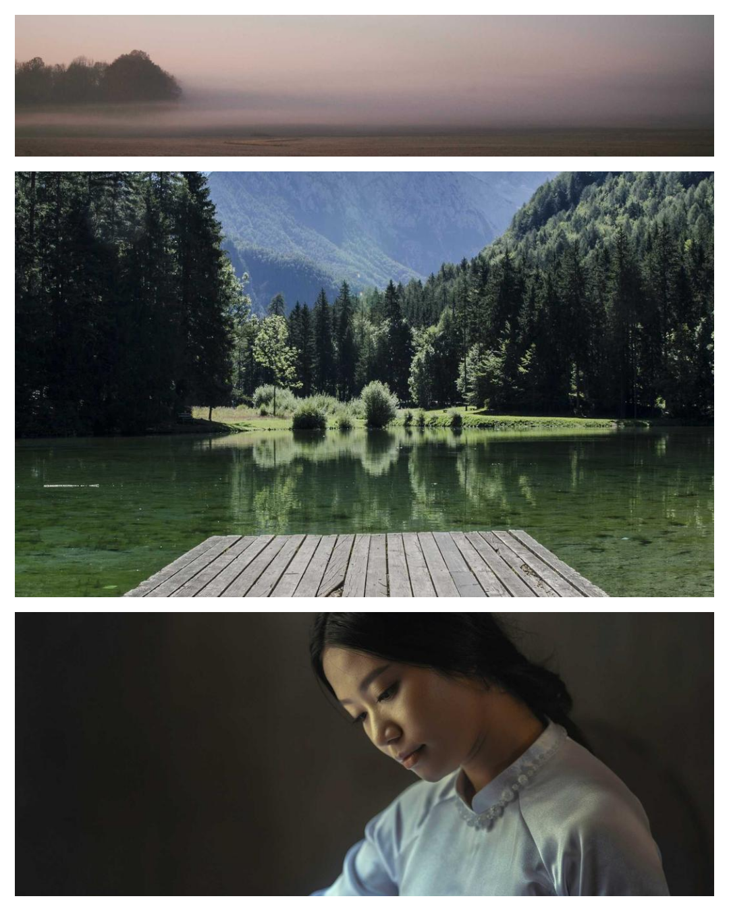

# photo-layout

A minimal tool for building Instagram carousel posts using plain HTML and CSS Grid. Each slide is an HTML file with a custom grid layout. A Bun + Playwright script exports every slide as a 1080×1350px PNG ready to upload.

## Examples

<p float="left">
  
  
  
</p>

## Usage

```bash
bun install
bunx playwright install chromium

# export a post to PNG
bun export.ts posts/<post-name>
# → export/2026-05-27_<post-name>/1.png, 2.png, ...
```

## How it works

- Each post lives in `posts/<name>/` with its HTML slides and an `assets/` folder
- Copy `_template.html` to start a new slide and define the grid layout with CSS Grid
- `shared.css` controls the canvas size (1080×1350px) and white border width (`--gap`)
- Use `object-position: X% Y%` on each `` to control the crop position
